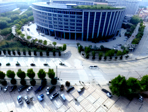

# AeroDiffusion: Complex Aerial Image Synthesis with Keypoint-Aware Text Descriptions and Feature-Augmented Diffusion Models


---




[//]: # (## Environment)

[//]: # ()
[//]: # (Follow the steps below to create and activate the AeroDiffusion environment:)

[//]: # ()
[//]: # (```shell)

[//]: # (conda create -n aerodiff python=3.11)

[//]: # (conda activate aerodiff)

[//]: # (conda install pytorch torchvision torchaudio cudatoolkit=10.2 -c pytorch-lts)

[//]: # (git clone git@github.com:NolimitDougie/AeroDiffusion.git)

[//]: # (cd AeroDiffusion)

[//]: # (pip install -r requirements.txt)

[//]: # (```)

[//]: # ()
[//]: # (##  Training the Object Detection Model)

[//]: # (```shell)

[//]: # (cd yolov5)

[//]: # (python train.py --img 640 --batch 16 --epochs 100 --data visdrone.yaml --weights yolov5s.pt --project visdrone-results --name yolov5-visdrone)

[//]: # (```)

[//]: # (## Configuration for Aero Diffusionn)

[//]: # (To integrate the trained YOLOv5 model into the AeroDiffusion pipeline:)

[//]: # ()
[//]: # (1. **Locate the Trained Checkpoint**  )

[//]: # (   Find the trained checkpoint file &#40;e.g., `best.pt`&#41; in the specified training directory &#40;e.g., `visdrone-results/yolov5-visdrone`&#41;.)

[//]: # ()
[//]: # (2. **Add the Checkpoint File**  )

[//]: # (   Update the [yolov5/region.py]&#40;yolov5/region.py&#41; file to reference the trained checkpoint file.)

[//]: # ()
[//]: # (By completing these steps, the AeroDiffusion framework will effectively utilize the YOLOv5-trained model for object detection.)

[//]: # ()

## Data Preparation
* Download the VisDrone DET dataset [here](https://drive.google.com/file/d/1a2oHjcEcwXP8oUF95qiwrqzACb2YlUhn/view?pli=1).
* The corresponding text descriptions for the dataset are available in [text_descriptions](text_descriptions)


[//]: # (## Training)

[//]: # (Define your directory paths, device configuration, and training parameters in `config.yaml`, then execute the script.)

[//]: # (```shell)

[//]: # (python main.py)

[//]: # (```)

[//]: # (## Generating Aerial Images)

[//]: # ()
[//]: # (Specify your directory paths, device configuration, inference steps, and guidance scale in `config.yaml`, then execute the script.)

[//]: # (```shell)

[//]: # (python main.py)

[//]: # (```)
